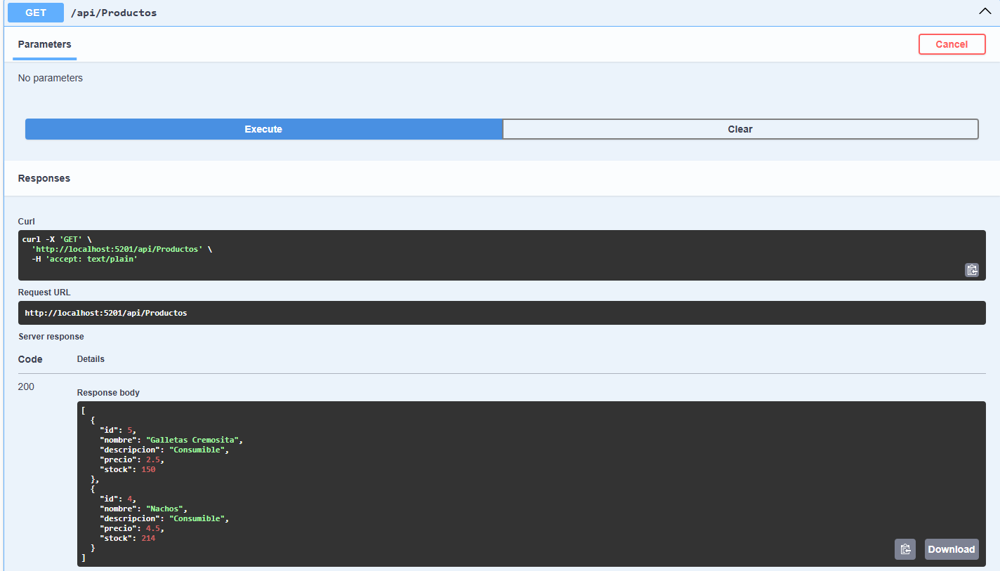
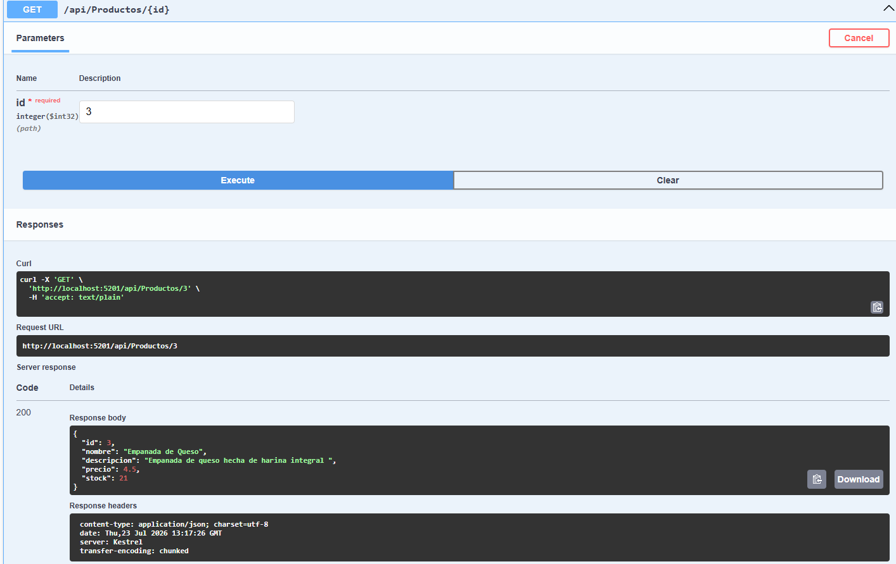
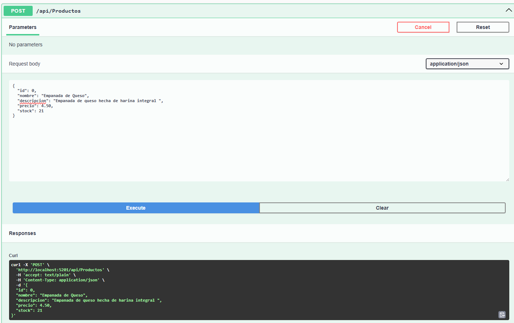
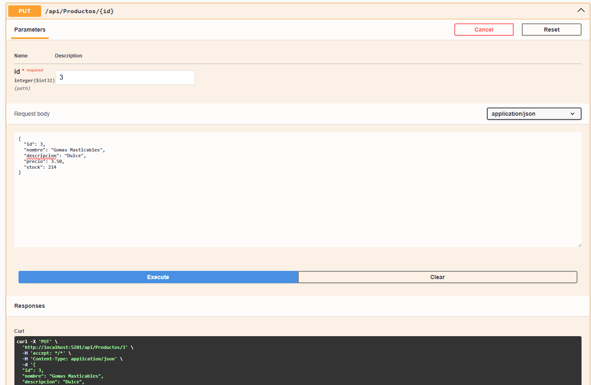
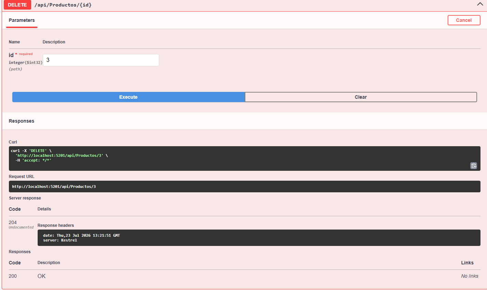
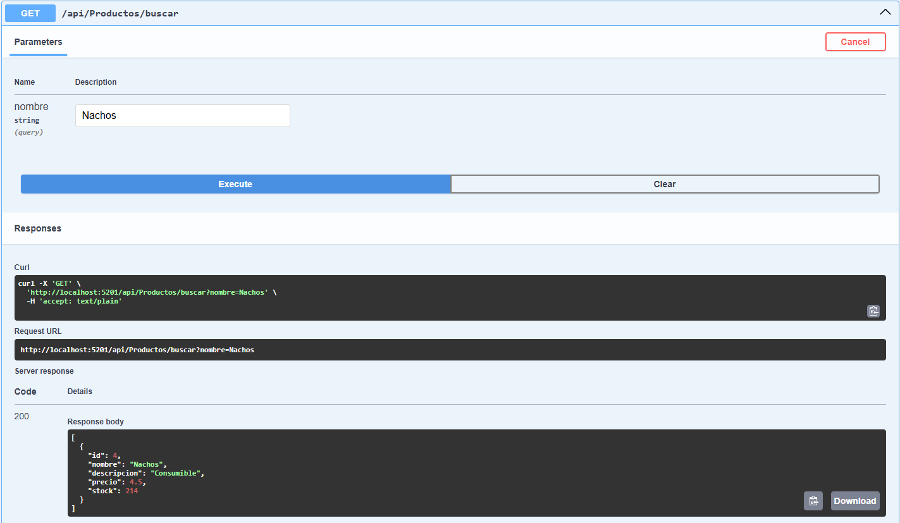
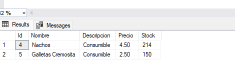

API Products

API REST desarrollada con **ASP.NET Core Web API**, **Entity Framework Core**, **SQL Server** y **Swagger** para la gestión de productos.

---

## Tecnologías utilizadas

- ASP.NET Core Web API (.NET 9)
- Entity Framework Core
- SQL Server
- Swagger

---

## Requisitos

- .NET 9 SDK
- SQL Server
- Visual Studio 2022 o Visual Studio Code

---

## Configuración

1. Clonar el repositorio.

```bash
git clone https://github.com/USUARIO/ProductosAPI.git
```

2. Configurar la cadena de conexión en **appsettings.json**.

3. Ejecutar las migraciones.

```bash
dotnet ef database update
```

4. Ejecutar el proyecto.

```bash
dotnet run
```

5. Abrir Swagger.

```
https://localhost:xxxx/swagger
```

---

## Endpoints

| Método | Endpoint |
|---------|----------|
| GET | /api/productos |
| GET | /api/productos/{id} |
| POST | /api/productos |
| PUT | /api/productos/{id} |
| DELETE | /api/productos/{id} |
| GET | /api/productos/buscar?nombre=producto |

---

# Evidencias

## 1. GET Productos



---

## 2. GET por ID



---

## 3. POST



---

## 4. PUT



---

## 5. DELETE



---

## 6. Buscar



---

# Base de datos

La base de datos fue creada mediante **Entity Framework Core Migrations** utilizando el comando:

```bash
dotnet ef database update
```

La tabla creada es:

- Productos

---
Evidencia de que guarda la base de datos 


# Autor

Ander
